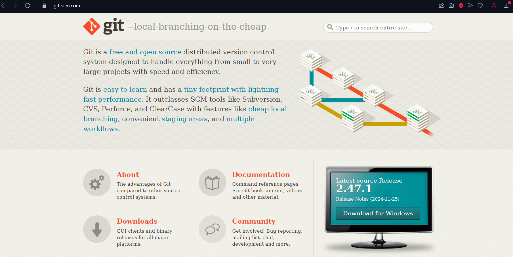
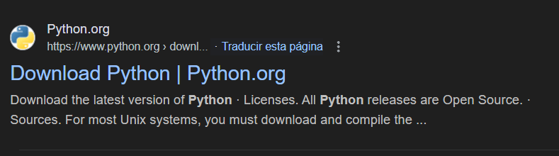
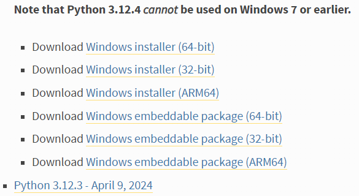
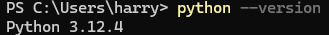
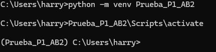
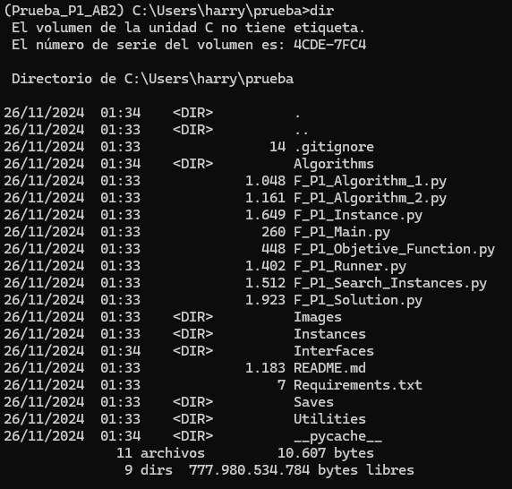

# Jorge Camacho Mejías - Práctica 1 - Python

## Clonar Repositorio desde GitHub
Se recomienda clonar el repositorio desde GitHub: https://github.com/JorgeCM2004/Practica1_Algoritmos_de_Busqueda_II

Para clonar un repositorio es necesario tener instalado alguna version de _git_ en tu ordenador.
La forma mas fácil es ir al sitio oficial y descargarlo:


Tras tener instalado _git_, debes acceder al repositorio de GitHub y en la pestaña que se despliega al hacer click en el botón "Code" debes seleccionar HTTP y copiar el enlace:


## Crear Entorno de Ejecución

Para comenzar la práctica debemos crear un entorno donde se pueda ejecutar:

### 1. Instalación de Python.

Para instalar python nos dirigiremos a nuestro navegador de confianza y buscaremos la página oficical de python:



E instalaremos la versión __3.12.4__ para nuestro sistema operativo:



❗Es de suma importancia que en la instalación se seleccione la casilla de añadir al PATH❗

Si la instalación se ha realizado correctamente al abrir una terminal y ejecutar el codigo:

```bash
python --version
```

Deberia salir algo tal que:




### 2. Creación y activación de venv.

Tras haber instalado correctamente la versión de python deseada, procederemos a crear un entorno virtual para que todas las descargas de librerias que realicemos sean almacenadas en el entorno y no en la version "base" de python.

Para ello usaremos el siguiente comando:
```bash
python -m venv nombre_del_entorno
```

Tras crearlo lo activamos con el siguiente comando:

Windows: (Usar CMD, si usas Powershell da problemas con los permisos)
```bash
nombre_del_entorno\Scripts\activate
```

macOS/Linux:
```bash
source nombre_del_entorno/bin/activate
```

Si esta hecho correctamente se deberia ver algo asi:



Si quieres desactivar el entorno solo debes usar el comando:

### 3. Instalación de recursos

Con el entorno activado nos movemos al directorio que hemos clonado desde github:



Ahora procedemos a instalar todos los paquetes necesarios especificados en Requirements.txt con el siguiente comando:
```bash
pip install -r Requirements.txt
```

Tras estos pasos, tendrás tu entorno virtual listo para poder ejecutar todos los archivos que más adelante explicaré su funcionamiento.

## Archivos a Ejecutar
En este apartado, te explicaré que archivos puedes ejecutar y cual es su funcionamiento.
Aunque el código está realizado para que se pueda ejecutar desde cualquier parte, se recomienda encarecidamente que se ejecute desde el directorio raiz o desde las subcarpetas donde se encuentran los archivos ejecutables.

❗La primera ejecución es más lenta al no haber incluido los archivos "\_\_pycache__" en el repositorio.❗

### F_P1_Main
El archivo main es el más sencillo de todos pero, a la vez, con el que el usuario más puede interactuar.
El archivo main usa la clase "Runner" (Experiment), esta es la que se encarga de lanzar los algoritmos por lo que si alguien quiere cambiar los parametros (alpha, t0, ...) debe configurarlo desde esta clase. Main es un archivo para el usuario común que solo quiere lanzar el programa sin preocupaciones. Por ello desde main solo se pueden configurar:
- Tipo de algoritmo a utilizar: Puede usar "Algorithm_1" o "Algorithm_2".
- Tiempo por instancia: Utilizar tiempos muy pequeños por instancia puede dar a que este se pase del tiempo maximo (unidades -> segundos).
- Guardar ejecución.

### F_P1_Test_Runner
Este archivo se encuentra en la carpeta de tests y se debe ejecutar con el siguiente comando:
```bash
pytest .\\F_P1_Test_Runner.py
```
Si quieres añadir más tests debes incluirlos en "F_P1_Tests.py" con el nombre de la instancia y el valor mínimo que se espera, además de incluir la instancia en la carpeta de instancias.
